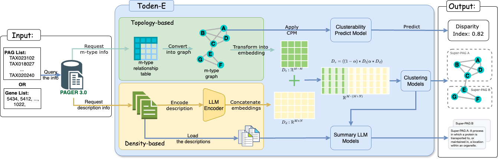

# Toden-E 
This code release accompanies the following paper:


## Toden-E: Topology-Based and Density-Based Ensembled Clustering for the Development of Super-PAG in Functional Genomics using PAG Network and LLM 

Qi Li, Cody Nichols, Robert S Welner, Jake Y. Chen, Wei-Shinn Ku1 and Zongliang Yue

### Abstract
<sup>The integrative analysis of gene sets, networks, and pathways is pivotal for deciphering omics data in translational biomedical research. To significantly increase gene coverage and enhance the utility of pathways, annotated gene lists, and gene signatures from diverse sources, we introduced pathways, annotated gene lists, and gene signatures (PAGs) enriched with metadata to represent biological functions. Furthermore, we established PAG-PAG networks by leveraging gene member similarity and gene regulations. However, in practice, high similarity in functional descriptions or gene membership often leads to redundant PAGs, hindering the interpretation from a fuzzy enriched PAG list. 
In this study, we developed todenE (topology-based and density-based ensemble) clustering, pioneering in integrating topology-based and density-based clustering methods to detect PAG communities leveraging the PAG network and Large Language Models (LLM). In computational genomics annotation, the genes can be grouped/clustered through the gene relationships and gene functions via guilt by association. Similarly, PAGs can be grouped into higher-level clusters, forming concise functional representations called Super-PAGs. TodenE captures PAG-PAG similarity and encapsulates functional information through LLM, in characterizing network-based functional Super-PAGs. 
In synthetic data, we introduced a metric called the Disparity Index (DI), measuring the connectivity of gene neighbors to gauge clusterability. We compared multiple clustering algorithms to identify the best method for generating performance-driven clusters. In non-simulated data (Gene Ontology), by leveraging transfer learning and LLM, we formed a language-based similarity embedding. TodenE utilizes this embedding together with the topology-based embedding to generate putative Super-PAGs with superior performance in semantic and gene member inclusiveness. </sup>



## Setup

1) Clone the repo:  

```bash
git clone https://github.com/ai-pharm-AU/Toden-E.git
```

2) Install the Python packages (we used Python 3.10): 

```bash
cd Toden-E
conda env create -f environment.yml
conda activate toden_e
```

## Running Toden-E

1) Discover the super-pags with a list of gene:

```python
python toden_e.py --file_path file_name.txt
```

