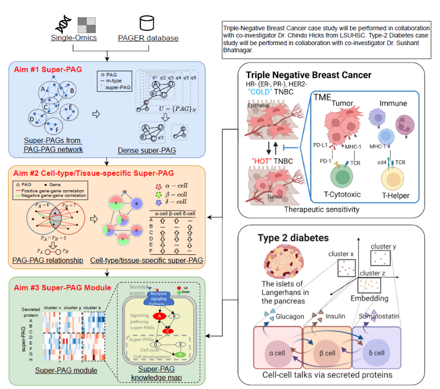
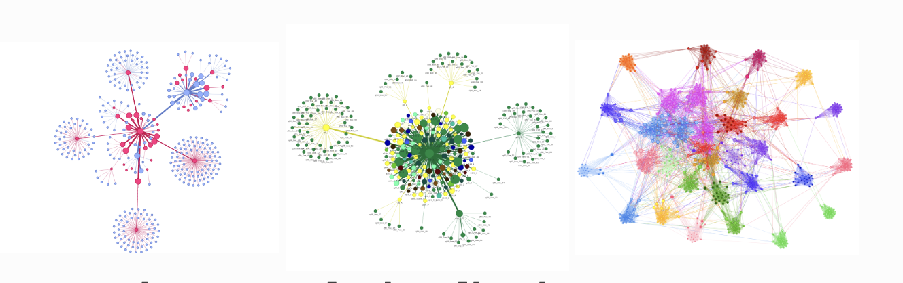
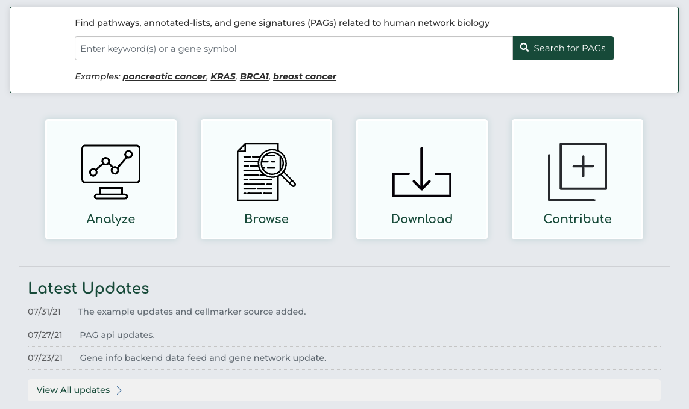

# Super_PAG
The super-PAGs will become a new and comprehensive publicly accessible non-redundant super-geneset source with curated biological context.

# Lead professor
[Dr. Yue](https://pharmacy.auburn.edu/directory/zongliang-yue.php) from Harrison College of Pharmacy. He is an assistant research professor in the Harrison College of Pharmacy's Department of Health Outcomes Research and Policy. He joined the college in March 2023. Dr. Yue's past research has focused on utilizing biological data mining, systems biology, network biology, machine learning, visual analytics, and translational informatics to improve human health. He has also constructed several web servers and applications for functional genomics downstream analysis and drug repositioning.

# Research Strategies

# Visualization with Python
1.[Networkx](https://networkx.org/) 

  
   
2.[PyVis](https://pyvis.readthedocs.io/en/latest/index.html)

   

# The algorithms for partitioning a weighted graph
### 1. BSF(Breadth-First-Search)
   
The well-known **BFS (Breadth-First-Search)** algorithm can also be used for graph partitioning. BFS algorithm traverses the graph level by level and marks each vertex with the level in which it was visited. After completion of the traversal, the set of vertices of the graph is portioned into two parts `V1` and `V2` by putting all vertices with level less than or equal to a pre-determined threshold `L` in the set `V1` and putting the remaining vertices (with level greater than `L`) in the set `V2`. `L` is so chosen that `|V1|` is close to `|V2|`.

### 2. Kernighan-Lin Algorithm
   
The **Kernighan-Lin algorithm** (KL algorithm hereafter) is one of the oldest heuristic graph partitioning algorithms proposed in 1970 [6]. In the simplest possible setting, the KL algorithm takes an edge-weighted graph `G = (V, E, edge-weight function c)` with `2n` vertices and an initial bi-partition `(V1, V2)` of the vertex set `V` where `|V1| = |V2| = n` and produces a new partition `(V1’, V2’)` such that `|V1’| = |V2’| = n` and the total cost of the new partition is lower than (or equal to) the cost of the original partition.

### 3. Fiduccia-Mattheyses Algorithm

The **Fiduccia-Mattheyses algorithm** (FM algorithm hereafter) is a significant advancement in the field of graph partitioning, introduced by C.M. Fiduccia and R.M. Mattheyses in 1982. This algorithm is an improvement over the Kernighan-Lin algorithm and is specifically designed for partitioning large-scale VLSI circuits.

The FM algorithm operates on an edge-weighted graph `G = (V, E, edge-weight function c)` and aims to optimize the partitioning of the graph's vertices into two subsets, `V1` and `V2`, while maintaining a balance between the sizes of these subsets. Unlike the Kernighan-Lin algorithm, which swaps pairs of vertices between partitions, the FM algorithm moves individual vertices across the partition boundary. This approach allows for more granular adjustments, often leading to better optimization in fewer iterations.

A key feature of the FM algorithm is its use of a data structure called a **gain bucket**, which efficiently identifies the vertices whose movement would most decrease the cut size (i.e., the number of edges crossing the partition boundary). The algorithm iteratively moves the vertex with the highest gain from one partition to the other, updating the gains of adjacent vertices as it proceeds.

### 4. Spectral Bisection Algorithm

The **Spectral Bisection Algorithm** is a method used in graph partitioning, which utilizes the spectral properties of graphs to find an optimal bisection. This algorithm is particularly effective for partitioning sparse graphs and is widely used in various applications, including parallel computing, VLSI design, and network analysis.

The Spectral Bisection Algorithm operates based on the following steps:

4.1 **Laplacian Matrix**: It begins by constructing the Laplacian matrix `L` of the graph `G`. The Laplacian matrix is defined as `L = D - A`, where `D` is the degree matrix and `A` is the graph's adjacency matrix.

4.2 **Eigenvalues and Eigenvectors**: The algorithm then computes the eigenvalues and eigenvectors of the Laplacian matrix. The second smallest eigenvalue (known as the Fiedler value) and its corresponding eigenvector (the Fiedler vector) are of particular interest.

4.3 **Partitioning**: The graph is partitioned into two sets based on the sign of the components of the Fiedler vector. Nodes corresponding to positive components of the Fiedler vector are placed in one set, and those corresponding to negative components are placed in the other set.

# PAGER 3.0 Dateset [API](http://discovery.informatics.uab.edu/PAGER/)

# Relate works
1. [PAGER: constructing PAGs and new PAG–PAG relationships for network biology](https://www.ncbi.nlm.nih.gov/pmc/articles/PMC4553834/pdf/btv265.pdf)
2. [PAGER 2.0: an update to the pathway, annotated-list and gene-signature electronic repository for Human Network Biology](https://pubmed.ncbi.nlm.nih.gov/29126216/)

